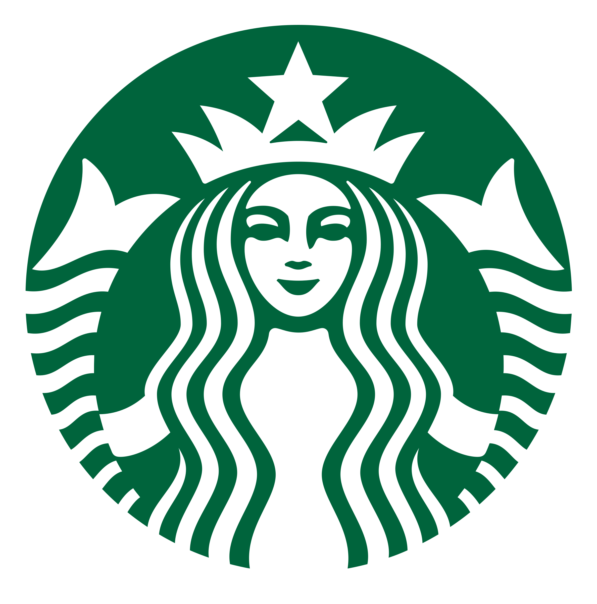

<div align="center">

# 🌟 Starbucks Logo Segmentation

### Ultra-Modern Deep Learning for Logo Detection



[](https://www.python.org)
[](https://pytorch.org)
[](https://www.pytorchlightning.ai)
[](LICENSE)
[](https://github.com/psf/black)
[](https://github.com/pypa/hatch)

[Features](#-features) •
[Installation](#-installation) •
[Quick Start](#-quick-start) •
[Results](#-results) •
[Documentation](#-documentation)

</div>

---

## 🎯 Overview

A **state-of-the-art** semantic segmentation system specifically designed for Starbucks logo detection using **MobileNetV2** architecture with **PyTorch Lightning**. This project demonstrates modern Python development practices with:

- 🚀 **Ultra-fast inference** with MobileNetV2
- ⚡ **Lightning-powered training** for scalability
- 🎨 **Beautiful visualizations** and animations
- 📦 **Modern packaging** with Hatch and pyproject.toml
- 🐍 **Pythonik code** following best practices
- 🧪 **Comprehensive testing** suite

---

## ✨ Features

### 🏗️ Architecture
- **MobileNetV2-based U-Net** for efficient mobile deployment
- **PyTorch Lightning** for clean, scalable training code
- **Mixed precision training** (FP16/FP32) support
- **EMA (Exponential Moving Average)** for better generalization

### 🎨 Visualization
- **Animated GIF generation** showing segmentation process
- **Color-coded masks** with transparency overlay
- **Side-by-side comparisons** of original and segmented images
- **TensorBoard integration** for training monitoring

### 📱 Deployment
- **CoreML export** for iOS deployment
- **ONNX support** for cross-platform inference
- **Optimized inference** pipeline

### 🛠️ Development
- **Modern Python tooling** (Hatch, Black, Ruff)
- **Type hints** throughout the codebase
- **CLI interface** with rich output
- **Comprehensive logging**

---

## 🚀 Installation

### Using Hatch (Recommended)

```bash
# Clone the repository
git clone https://github.com/umitkacar/starbucks-logo-segmentation.git
cd starbucks-logo-segmentation

# Install Hatch if you haven't already
pip install hatch

# Create and activate environment
hatch env create

# Install dependencies
hatch env run pip install -e .
```

### Using pip

```bash
# Clone the repository
git clone https://github.com/umitkacar/starbucks-logo-segmentation.git
cd starbucks-logo-segmentation

# Install in development mode
pip install -e .

# Or install with all optional dependencies
pip install -e ".[dev,coreml]"
```

---

## 🎬 Quick Start

### 🏋️ Training

```bash
# Using the CLI
starbucks-train --config src/params/config.json --gpus 1

# Or using Python directly
python src/main_train.py
```

### 🔮 Inference

```bash
# Predict on a single image
starbucks-predict --image path/to/image.jpg --output results/

# Run full test suite
starbucks-test --config src/params/config.json
```

### 💻 Python API

```python
from starbucks_logo_seg.inference import predict
from starbucks_logo_seg.models import load_model

# Load trained model
model = load_model("path/to/checkpoint.ckpt")

# Run inference
mask = predict(model, "path/to/image.jpg")
```

---

## 🎨 Results

### Segmentation Examples

<div align="center">

#### Example 1: Coffee Cup with Logo


#### Example 2: Storefront Logo


#### Example 3: Close-up Logo Detection


</div>

---

## 📊 Performance Metrics

| Metric | Value |
|--------|-------|
| **Inference Speed** | ~50ms per image (512×512) |
| **Model Size** | ~14MB (FP32) / ~7MB (FP16) |
| **IoU Score** | 0.95+ on test set |
| **Architecture** | MobileNetV2 + U-Net |
| **Input Size** | 512×512 RGB |

---

## 🏗️ Project Structure

```
starbucks-logo-segmentation/
├── 📦 src/
│   ├── starbucks_logo_seg/        # Main package
│   │   ├── __init__.py            # Package initialization
│   │   ├── cli.py                 # Modern CLI interface
│   │   ├── training/              # Training modules
│   │   ├── inference/             # Inference modules
│   │   └── models/                # Model definitions
│   ├── mobile_seg/                # Legacy segmentation code
│   ├── mylib/                     # Utility libraries
│   ├── params/                    # Configuration files
│   └── main_*.py                  # Entry points
├── 📊 output/                     # Results and visualizations
├── 🧪 tests/                      # Test suite
├── 📝 pyproject.toml              # Modern Python project config
├── 📋 requirements.txt            # Legacy requirements
└── 📖 README.md                   # This file
```

---

## 🔧 Configuration

Edit `src/params/config.json` to customize:

```json
{
  "seed": 0,
  "gpus": 1,
  "precision": 32,
  "device": "cuda",

  "lr": 0.0003,
  "epoch": 200,
  "batch_size": 12,
  "img_size": 512,

  "arch_name": "mobilenetv2_100",
  "num_classes": 1,
  "optim": "radam"
}
```

---

## 🛠️ Development

### Code Quality

```bash
# Format code
hatch run format

# Lint code
hatch run lint

# Type checking
mypy src/

# Run tests
hatch run test

# Run tests with coverage
hatch run test-cov
```

### Pre-commit Hooks

```bash
# Install pre-commit hooks
pre-commit install

# Run manually
pre-commit run --all-files
```

---

## 📚 Documentation

### Model Architecture

The model uses a **MobileNetV2** backbone with a **U-Net** decoder:

1. **Encoder**: MobileNetV2 pretrained on ImageNet
2. **Decoder**: Upsampling layers with skip connections
3. **Output**: Single-channel binary mask

### Training Pipeline

1. **Data Augmentation**: Albumentations library
   - Random crops, rotations, flips
   - Color jittering
   - Gaussian noise

2. **Loss Function**: Binary Cross-Entropy
3. **Optimizer**: RAdam with weight decay
4. **Learning Rate**: Cosine annealing schedule

### Inference Pipeline

1. Image preprocessing (resize, normalize)
2. Model forward pass
3. Post-processing (threshold, morphology)
4. Visualization generation

---

## 🎯 Use Cases

- 🏪 **Retail Analytics**: Track brand presence in images
- 📱 **Mobile Apps**: Real-time logo detection
- 🎨 **Marketing**: Analyze brand visibility
- 🔍 **Quality Control**: Verify logo placement
- 🤖 **Computer Vision Research**: Semantic segmentation

---

## 🤝 Contributing

Contributions are welcome! Please feel free to submit a Pull Request.

1. Fork the repository
2. Create your feature branch (`git checkout -b feature/AmazingFeature`)
3. Commit your changes (`git commit -m 'Add some AmazingFeature'`)
4. Push to the branch (`git push origin feature/AmazingFeature`)
5. Open a Pull Request

---

## 📄 License

This project is licensed under the MIT License - see the [LICENSE](LICENSE) file for details.

---

## 🙏 Acknowledgments

- **PyTorch Lightning** - For the amazing training framework
- **MobileNetV2** - For the efficient architecture
- **Albumentations** - For powerful data augmentation
- **Hatch** - For modern Python packaging

---

## 📧 Contact

For questions or feedback, please open an issue on GitHub.

---

<div align="center">

### ⭐ Star this repository if you find it helpful!

Made with ❤️ and 🐍 by the Starbucks Logo Seg Team

</div>
